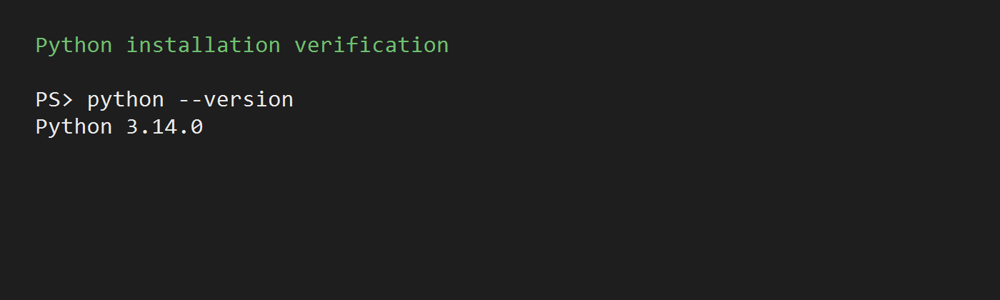
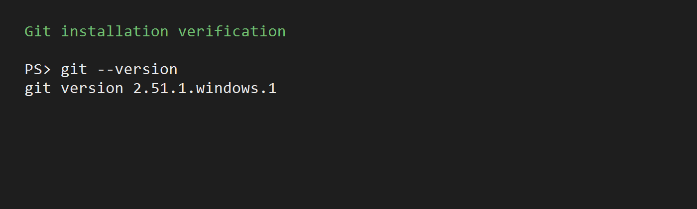
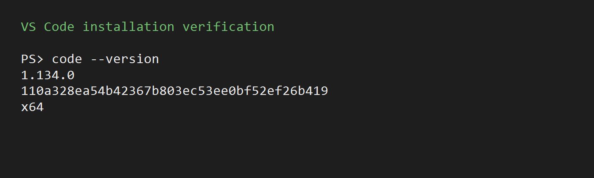

# Init IS310 Homework

## Proof of Installation

1. Python

   Installed: Python 3.14.0

   

2. Git

   Installed: Git 2.51.1.windows.1

   

3. VS Code

   Installed: Visual Studio Code 1.134.0

   

4. Hypothesis Username

   masonle

